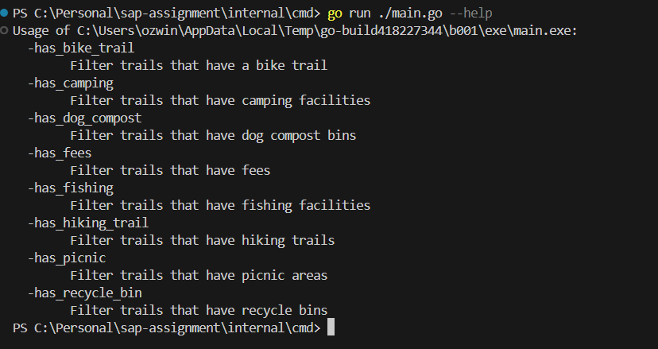
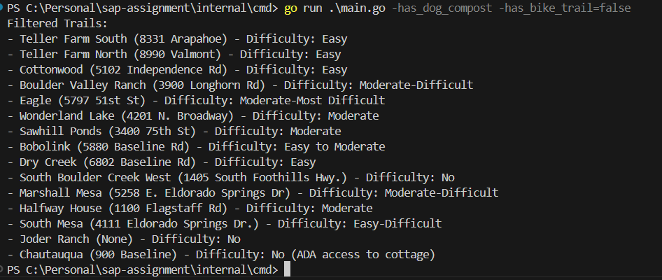
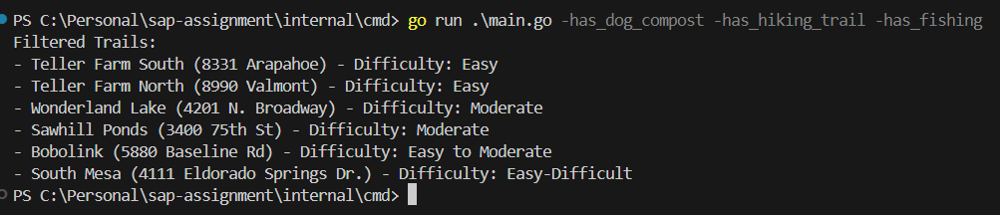

# SAP-Assignment
## About
This project intended to demonstrate a simple Trails lookup from the data source using various filtering options available
### Features 
+ The application is initialized with trail data from a CSV file
+ Provides a command line interface with multiple flags, which can be used to filter the available trails
+ Various application configs can be managed from the configs directory

## CLI Options
 
 

## How to Run? 

To run this application 

Clone the repo

> git clone https://github.com/ozwin/sap-assignment.git

Run the following from the root folder of the project
> cd ./internal/cmd
> 
> go run ./main.go --help

you will be able to see the below options

Now based on your preference, you can pass single/multiple arguments.

> go run .\main.go -has_dog_compost -has_bike_trail=false

All the available flags are boolean that take true/false as value, if the value is not explicitly passed for a flag then it's considered as true.
eg -has_bike_trail=true and -Has_bike_trail will yield the same results.

Or

Navigate to the VS Code Run and Debug menu, and launch 'Start CLI' from the preconfigured Launch.json. This will display the available flags for the application

## How to test?

This repo currently has unit test coverage for most of the functionalities, 

to test run the below command from the root of the project

> go test ./...

## To- Do
+ Proper error handling, cases such as CSV files don't have the required columns
+ Add docker support, load CSV file with docker volumne

## Project structure

**internal** Since this repo is meant only for internal features all code is bundled under this folder

**data** contains the raw data file provided as part of the assignment

**configs** contains app-specific configs
**cmd** contains the entry point for the applications

**app** contains the logic for the applications

**models** contains the models for the application

**services** contains the actual logic required for the application

## Architecture
This project is using layered architecture, with each layer loosely coupled with other

**Data layer**/**Models**: Since the scope of this project is simple, a simple model is used to map data from the CSV file and maintain it in memory

**Service layer**: This layer is responsible for the business logic of the application, it accesses the dal layer through the interface. This layer also ensures that there are no dependencies on the external user interfaces such as HTTP context, command line arg, buffer, etc and logic only depends on the function parameters, and the response is provided only through the returned values. 

**User Interface Layer/Presentation Layer**: This layer is responsible for accessing the application services. The same service layer can be used with any user interface. For this project we are using CLI and interaction is provided through various flags.
